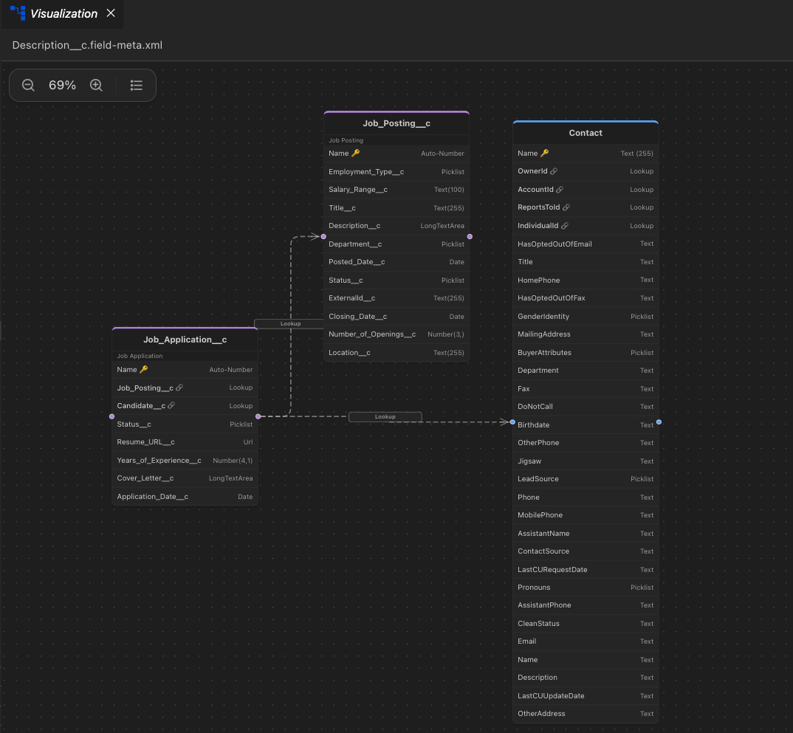

# Schema Visualizations

## Opening the Schema Visualization

When viewing an SObject or a field in VSCode, you'll find a **"Visualize"** button at the top right of the screen. Clicking this button will open the interactive schema visualization tool.

## Using the Visualization

The schema visualization provides an interactive view of your object relationships and field structures within the project.

### Features

- **Object View**: Displays the current SObject with all its fields
- **Relationship Mapping**: Shows parent and child relationships to other objects
- **Field Details**: View field types, properties, and metadata
- **Legend**: Shows definition of colors and line types for different SObject types and relationship types.
- **Zoom**: Use mouse wheel or pinch gestures to zoom in/out
- **Pan**: Click and drag to move around the canvas
- **Follow Relationships**: Click on relationship fields to navigate to related objects

### FAQs

| Question                                | Response                                                      |
| --------------------------------------- | ------------------------------------------------------------- |
| Does this show all SObjects in the org? | No, only the SObjects and fields which you have in your local |
| Can I hide SObjects                     | Not yet, all SObjects and fields will be displayed            |
