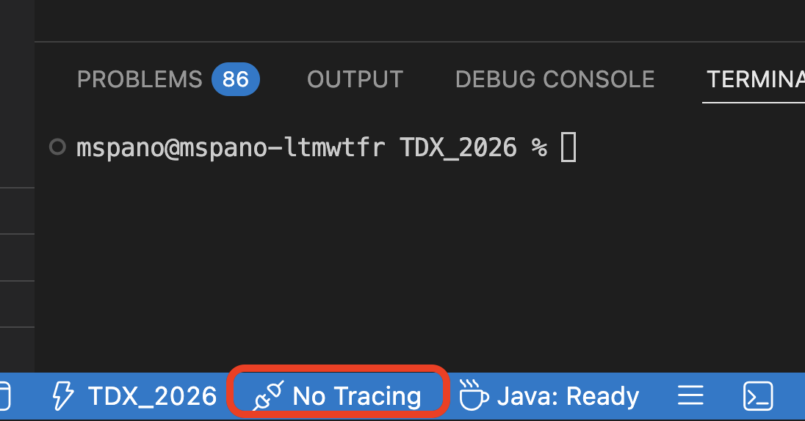
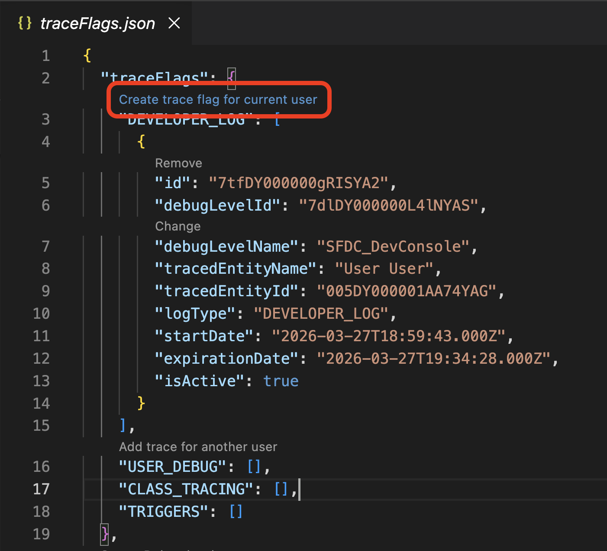
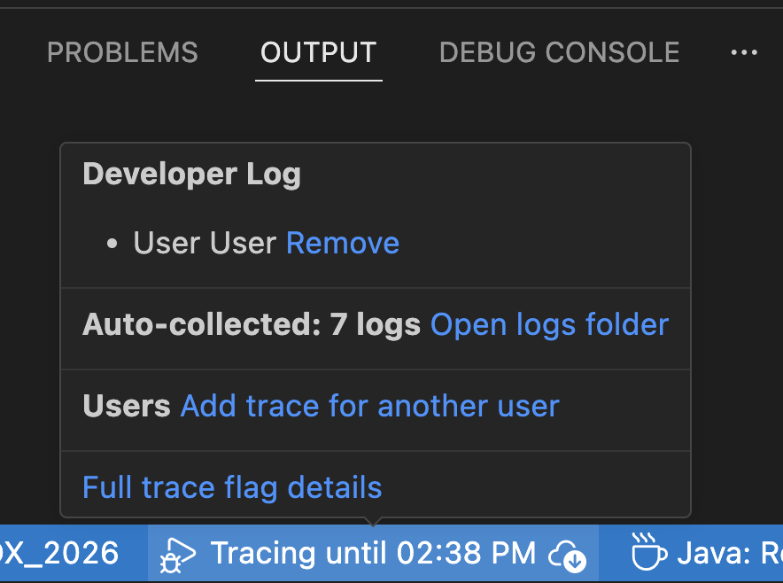

# Apex Debug Logs in the IDE

## Overview

It is now easier than ever to manage your debug logs from within the IDE.
You can set trace flags and log levels, view logs, and auto-debug logs for Anonymous Apex.

## Execute Anonymous

In the project, there's an [example.apex](../../scripts/example.apex) script.
This sets up some data, then rolls it back.

Open the script, then open the Command Palatte (`command + shift + P`) and select "SFDX: Execute Anonymous Apex with the Currently Open Editor".

This will execute the Apex, and the output will be available in the Output Panel.

## Capture More Logs

At the bottom of the screen, there's a debug tracing status indicator.
Initially, it will say "No Tracing"



If you click it, it will open a `traceFlags.json` file.

```json
{
  "traceFlags": {
    "DEVELOPER_LOG": [],
    "USER_DEBUG": [],
    "CLASS_TRACING": [],
    "TRIGGERS": []
  },
  "debugLevels": [
    {
      "id": "7dlDY000000L4lNYAS",
      "developerName": "SFDC_DevConsole",
      "masterLabel": "SFDC_DevConsole",
      "language": "en_US",
      "apexCode": "FINEST",
      "apexProfiling": "INFO",
      "callout": "INFO",
      "database": "INFO",
      "nba": "NONE",
      "system": "DEBUG",
      "validation": "INFO",
      "visualforce": "INFO",
      "wave": "INFO",
      "workflow": "INFO"
    },
    {
      "id": "7dlDY000000L4lrYAC",
      "developerName": "ReplayDebuggerLevels",
      "masterLabel": "ReplayDebuggerLevels",
      "language": "en_US",
      "apexCode": "FINEST",
      "apexProfiling": "INFO",
      "callout": "INFO",
      "database": "INFO",
      "nba": "INFO",
      "system": "DEBUG",
      "validation": "INFO",
      "visualforce": "FINER",
      "wave": "INFO",
      "workflow": "INFO"
    }
  ]
}
```

There is a "code lens" on this file which can be clicked to enable logging for the current user



Once that is created, the system will cature logs for the current user until the specified time.

### Retrieving Logs

Hover over the debug tracing status indicator and click the open logs folder



Debug logs will be saved here. This folder has a periodic interval for fetching logs, so you may need to wait for a little bit to see them.

## FAQs

| Question                                   | Response                                                                                                                  |
| ------------------------------------------ | ------------------------------------------------------------------------------------------------------------------------- |
| Why am I not seeing any logs?              | Verify trace flag is active, hasn't expired, and wait for periodic sync (1-2 minutes)                                     |
| How long do trace flags last?              | Duration is set when creating the trace flag, typically 1-24 hours                                                        |
| What's the difference between debug levels? | Control verbosity for apexCode, database, callout, system, etc. from NONE (silent) to FINEST (maximum detail)            |
| How do I change the log levels?            | Edit `traceFlags.json`, then use the code lens to create a new trace flag                                                 |
| Where are logs stored locally?             | `.sfdx/tools/debug/logs` directory. Click "open logs folder" from debug tracing hover to view                            |
| Can I set trace flags for other users?     | Yes, use USER_DEBUG type (requires appropriate org permissions)                                                           |
| How do I view Anonymous Apex results?      | Output Panel shows immediate results; detailed log saved to logs folder                                                   |
| What trace flag types are available?       | DEVELOPER_LOG (you), USER_DEBUG (others), CLASS_TRACING (classes), TRIGGERS (triggers)                                   |
| How often are logs fetched?                | Periodic interval; wait 1-2 minutes after execution for new logs to appear                                                |
| What does FINEST vs INFO mean?             | FINEST = maximum detail, larger logs. INFO = less detail, smaller logs                                                    |
