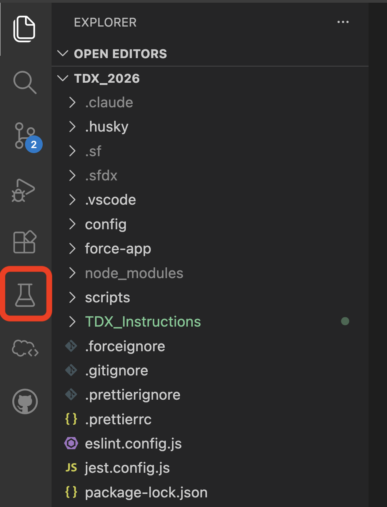
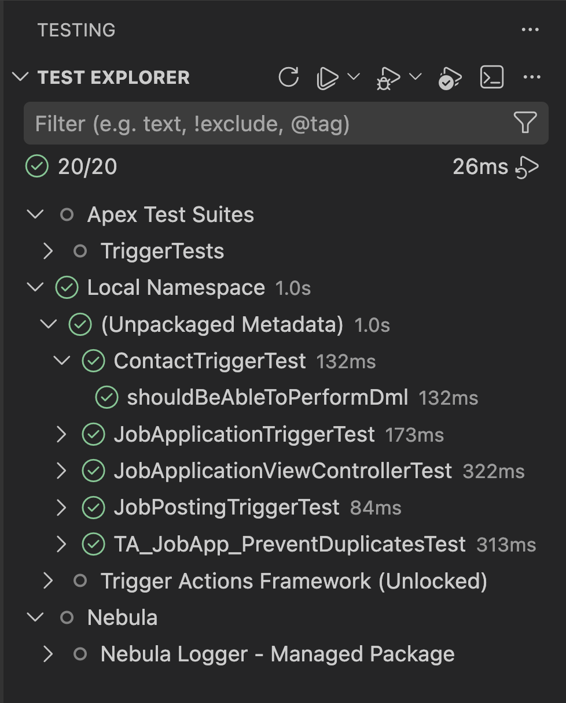
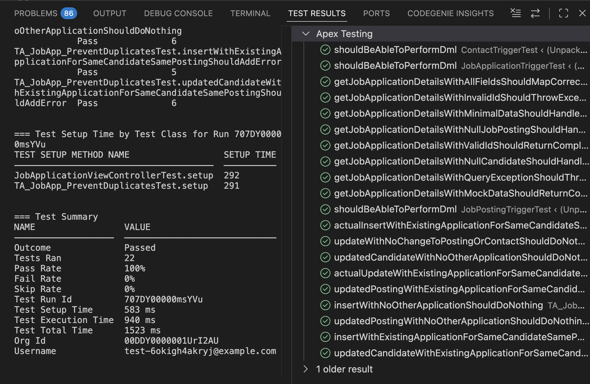

# Redesigned Apex Test Explorer

## Overview

The redesigned Apex Test Explorer provides a unified view of all executable tests in your org, making it easier to discover, run, and manage Apex tests directly from VS Code.

## Opening the Test Explorer

Click the **beaker icon** in the Activity Bar on the left side of VS Code to open the Test Explorer.

## Key Features

### All Tests in One Place

The Test Explorer now displays **all executable tests in the org**. They will be grouped by:

- Test Suites
- Namespace
  - Package
    - Test Class
    - Test Method

### Running Tests

**Run individual tests:**

- Click the play button next to any test method or group of tests.
- Test results will show up in the "TEST RESULTS" panel at the bottom of the screen.

### Filtering Tests

In the filter text, type `@`, then select the `@sf.apex.testController:in-workspace` tag.
This will filter the rendered tests to only the tests which you have in your local workspace.

### Quick Actions

- **Refresh**: Reload test list from the org
- **Run All Tests**: Execute all visible tests
- **Filter**: Search and filter tests by name
- **Go to Test**: Jump directly to test code

## FAQs

| Question                                   | Response                                                                                  |
| ------------------------------------------ | ----------------------------------------------------------------------------------------- |
| What tests does the Test Explorer show?    | All executable tests in the org, including local project tests and tests already deployed |
| How do I refresh the test list?            | Click the refresh button at the top of the Test Explorer                                  |
| Can I run tests from managed packages?     | Yes, if the managed package includes test classes, they will appear in the Test Explorer  |
| How do I see why a test failed?            | Click on the failed test to view the error message and stack trace                        |
| Can I run multiple test classes at once?   | Yes, select multiple tests or classes and run them together                               |
| Does it show code coverage?                | Yes, test results include coverage information for the code being tested                  |
| How is this different from the old viewer? | The redesigned explorer shows all tests in the org, not just tests in your local project  |
