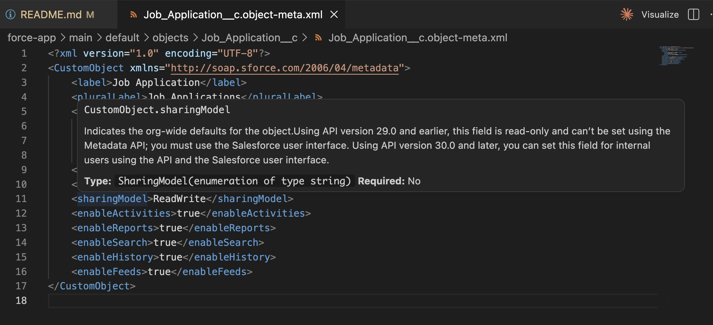

# Metadata XML Hover & Documentation

## Overview

VS Code now provides inline documentation for Salesforce metadata XML files. Hover over any XML element to see its description, type information, and whether it's required—pulled directly from Salesforce developer documentation.

## How It Works

When editing metadata XML files (`.object-meta.xml`, `.field-meta.xml`, etc.), hover over any XML node to see:

- **Description**: What the field does and how it's used
- **Type**: Data type and enumeration values
- **Required**: Whether the field is mandatory

In this example, hovering over `<sharingModel>` shows that it controls org-wide defaults for the object, is a SharingModel enumeration, and is not required.

You can view the same documentation on the Salesforce Developer website for side-by-side comparison:

[Metadata API Developer Guide - CustomObject](https://developer.salesforce.com/docs/atlas.en-us.api_meta.meta/api_meta/customobject.htm#:~:text=for%20the%20object.-,sharingModel)

The hover documentation in VS Code mirrors the official Metadata API reference, providing quick access without leaving your editor.

## Supported Metadata Types

Documentation is available for all metadata types in the Metadata API, including:

- **CustomObject**: Object definitions, sharing models, deployment status
- **CustomField**: Field types, formulas, picklist values
- **PermissionSet**: Object permissions, field permissions, user permissions
- And many more...

## FAQs

| Question                                    | Response                                                                                        |
| ------------------------------------------- | ----------------------------------------------------------------------------------------------- |
| What files does this work with?             | All Salesforce metadata XML files (.object-meta.xml, .field-meta.xml, .workflow-meta.xml, etc.) |
| Do I need to enable this feature?           | No, it's built into the Salesforce Extension Pack and works automatically                       |
| Where does the documentation come from?     | Directly from Salesforce Metadata API Developer Guide                                           |
| Can I see valid values for enumerations?    | Yes, hover shows the type and enumeration values where applicable                               |
| Does it work for custom metadata types?     | Yes, documentation is available for all standard and custom metadata                            |
| What if I need more detailed documentation? | Click through to the Metadata API reference guide for complete details and examples             |
| Does it work offline?                       | Initial documentation is cached, so basic hover information is available offline                |
