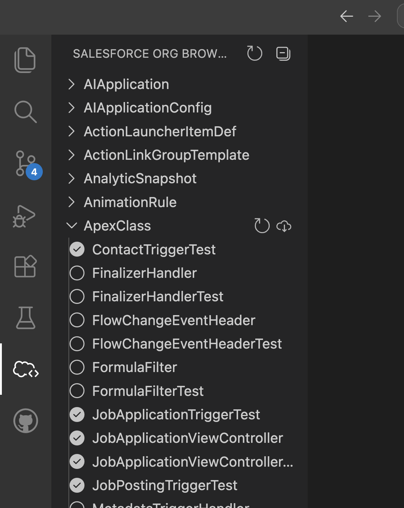
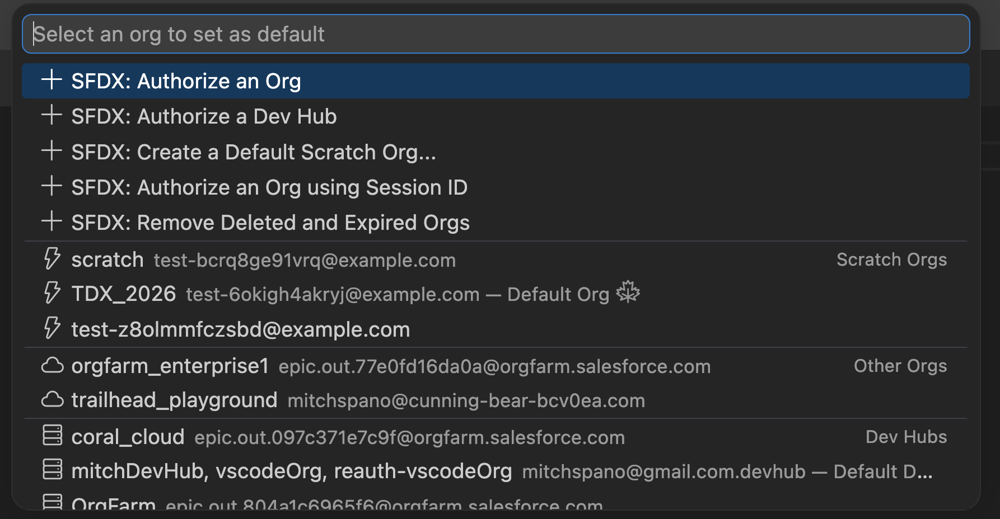
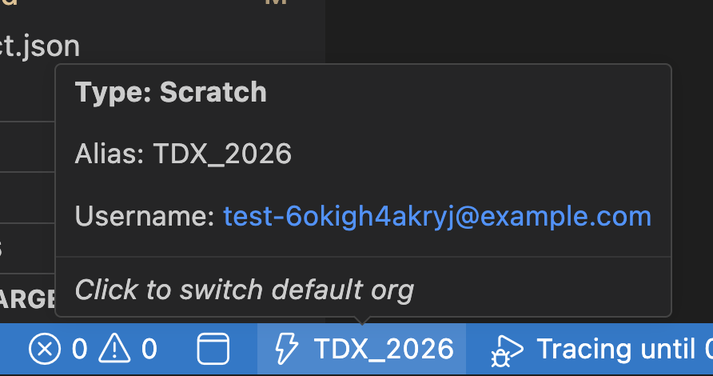

# Org Management in VS Code

## Overview

VS Code now provides enhanced org management capabilities, making it easier to browse metadata, switch between orgs, and understand which files are in your local workspace versus deployed in the org.

## Org Browser

The Org Browser displays all metadata in your connected org with visual indicators showing local workspace status.

### Status Icons

Each metadata item shows a status icon on the left:

- **Open Circle**: Metadata exists in the org but not in your local workspace
- **Check mark**: Metadata exists in both the org and your local workspace

This makes it easy to identify which components you have locally and which you may need to retrieve from the org.

### Browsing Metadata

The Org Browser organizes metadata by type:

- **ApexClass**: All Apex classes in the org
- **ApexTrigger**: Triggers on objects
- **CustomObject**: Standard and custom objects
- **CustomField**: Fields on objects
- **Flow**: Flows and process builders
- And many more metadata types...

Expand any type to see all components of that type. Click a component to view or retrieve it.

## Org Picker

The Org Picker shows all authenticated orgs and allows you to quickly switch between them.

### Org Type Indicators

Each org displays a graphical icon indicating its type:

- **Lightning bolt ⚡**: Scratch Orgs
- **Wrench 🔧**: Dev Hubs
- **Cloud ☁️**: Sandboxes and Developer Orgs
- **Building 🏢**: Production Orgs

The org picker groups orgs by category for easy navigation:

- Scratch Orgs
- Default Org
- Other Orgs
- Dev Hubs
- Default DevHub

### Org Details Footer

Click on any org in the picker to see detailed information in the footer.

The footer hover displays:

- **Type**: Org type (Scratch, Sandbox, Production, Dev Hub)
- **Alias**: Your local alias for the org
- **Username**: The authenticated username

### Switching Default Org

To change your default org:

1. Open the Org Picker (click the org name in the status bar)
2. Select an org from the list
3. Click "Click to switch default org" in the footer

The status bar will update to show the new default org, and all Salesforce commands will target that org.

## FAQs

| Question                                       | Response                                                                               |
| ---------------------------------------------- | -------------------------------------------------------------------------------------- |
| How do I open the Org Browser?                 | Click the Salesforce icon in the Activity Bar, then expand "Salesforce Org Browser"    |
| What does the cloud icon mean?                 | The metadata exists in the org but not in your local workspace                         |
| How do I retrieve metadata from the org?       | Right-click the component in Org Browser and select "Retrieve Source from Org"         |
| How do I switch default orgs?                  | Click the org name in the status bar, select a new org, then click "Click to switch"   |
| What's the difference between a star and bolt? | Star (⭐) marks the default org, bolt (⚡) indicates a scratch org                     |
| Can I see sandbox vs production visually?      | Yes, org type indicators and the org details footer show the org type                  |
| Do I need to authorize orgs first?             | Yes, use "SFDX: Authorize an Org" command to add orgs to the picker                    |
| How do I know which org I'm working with?      | Check the status bar at the bottom of VS Code - it shows the current default org alias |
