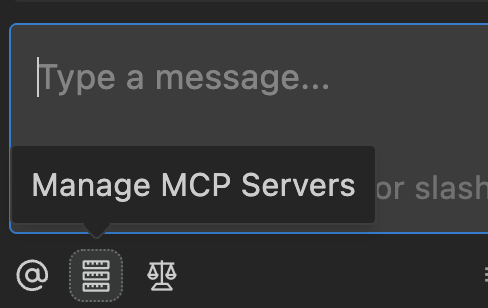
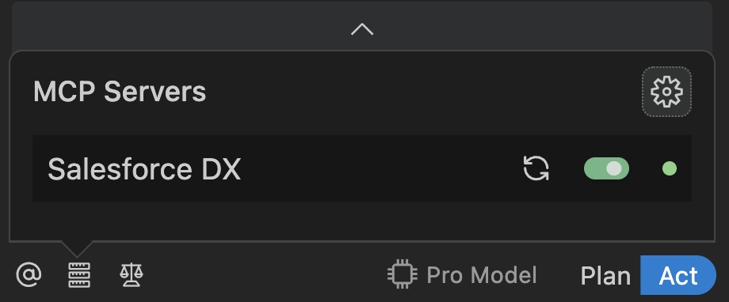

# DX MCP

## Overview

The DX MCP (Model Context Protocol) server enables Agentforce Vibes to interact directly with Salesforce orgs which enables automating test generation, code analysis, deployment, and metadata operations.

## Setup

Open Agentforce Vibes. Click the "Manage MCP servers" then the gear icon:




Then press "Configure MCP Servers".

In the MCP server configuration, make sure the following CLI arguments are present:

```json
{
  "mcpServers": {
    "https://github.com/salesforcecli/mcp": {
      "disabled": false,
      "timeout": 600,
      "type": "stdio",
      "command": "node",
      "args": [
        "/Users/mspano/Library/Application Support/Code/User/globalStorage/salesforce.salesforcedx-einstein-gpt/MCP/a4d-mcp-wrapper.js",
        "@salesforce/mcp@latest",
        "--orgs",
        "ALLOW_ALL_ORGS",
        "--toolsets",
        "core,orgs,metadata,code-analysis", // make sure these toolsets are enabled.
        "--allow-non-ga-tools" // must allow non-ga tools
      ]
    }
  }
}
```

## Generate Test

Prompt:

> Help me to write the tests in `@/force-app/main/default/classes/TA_JobPosting_ValidateDatesTest.cls` based on the patterns represented in `@/force-app/main/default/classes/TA_JobApp_PreventDuplicatesTest.cls`.

This should produce a high quality test.

## Run Code Analyzer

Prompt:

> Now scan `@/force-app/main/default/classes/TA_JobPosting_ValidateDatesTest.cls` for problems using code analyzer and resolve the findings.

If the system prompts you, make sure you select "Salesforce Code Analyzer"

## Test and Deploy

Prompt:

> Now, perform a deploy of `@/force-app/main/default/classes/TA_JobPosting_ValidateDatesTest.cls` and run the `TA_JobPosting_ValidateDatesTest` test.

## FAQs

| Question                                 | Response                                                                                              |
| ---------------------------------------- | ----------------------------------------------------------------------------------------------------- |
| What is MCP?                             | Model Context Protocol enables Agentforce Vibes to interact with external systems like Salesforce CLI |
| What does `ALLOW_ALL_ORGS` mean?         | Grants access to all authenticated orgs; restrict by listing specific aliases instead                 |
| Why do I need `--allow-non-ga-tools`?    | Enables access to beta/preview tools needed for full functionality                                    |
| How do I troubleshoot connection issues? | Verify path exists, check Node.js is installed, run `sf org list`, restart Agentforce Vibes           |
| Can I use this with multiple orgs?       | Yes, Agentforce Vibes will use the default org or prompt you to specify which org                     |
