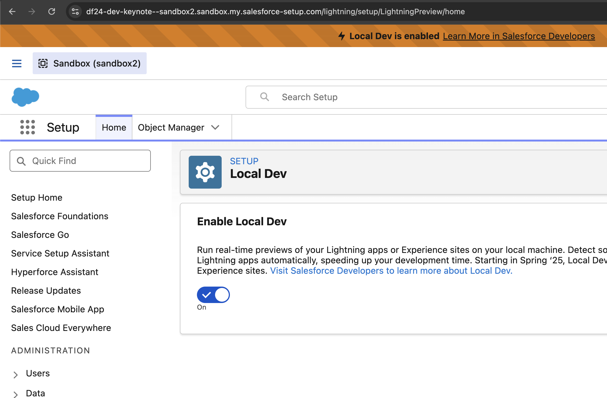
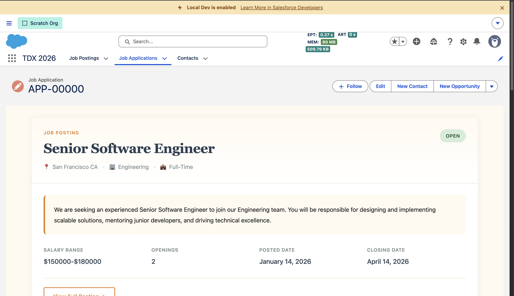
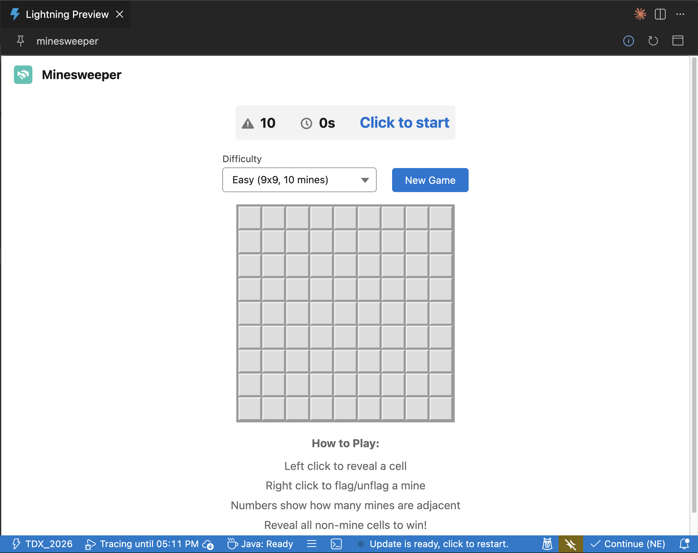

# LWC Dev and Live Preview

## Overview

## Setup

Install lightning dev plugin

```sh
sf plugins install @salesforce/plugin-lightning-dev@latest
```

Enable Local Dev

From Setup, in the Quick Find box, enter Local Dev and then select Local Dev. Select Enable Local Dev to turn on the feature for all org users.



## Preview a component in the org with hot reload

```sh
sf lightning dev app --name TDX_2026 --device-type desktop
```

Navigate to a `Job_Application__c` record.

Now, make a minor modification to the [`jobApplicationView.html`](../../force-app/main/default/lwc/jobApplicationView/jobApplicationView.html) and it should be immediately visible without a deploy.



Now open up Agentforce vibes and ask it to make a modification to the LWC and play with it live!

Press `command + c` to stop the preview.

## Preview a component in the IDE

Right click [`minesweeper.html`](../../force-app/main/default/lwc/minesweeper/minesweeper.html) and click `SFDX: Open in Lightning Preview`.

This should open a preview of the minesweeper component


